# ERP
---
[Disclaimer](https://github.com/i-sachinkumar/ERP#disclaimer-1)
---

## Mobile App Screenshots

Here are screenshots of different screens from the app:

  
  
  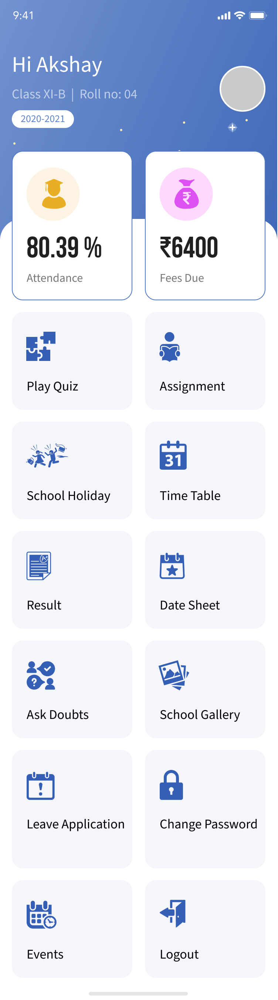

  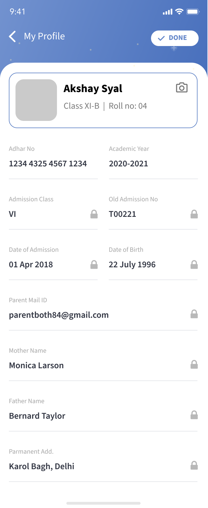
  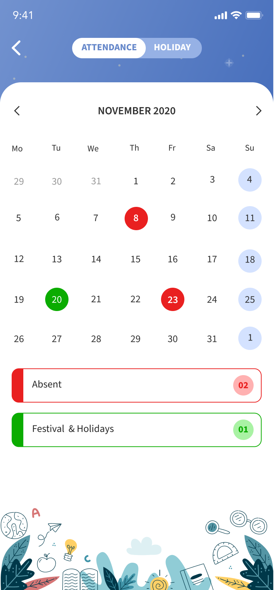
  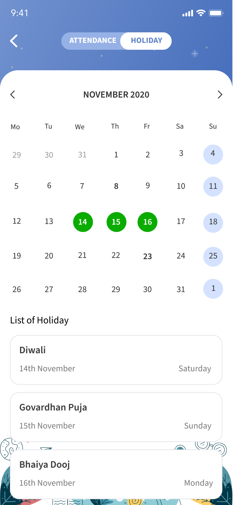

  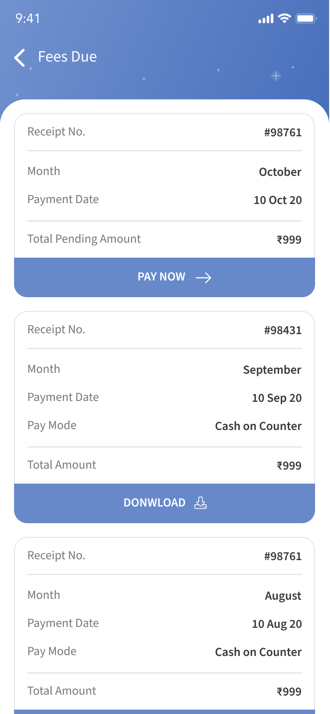
  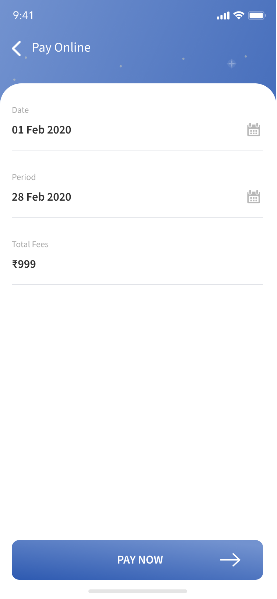
  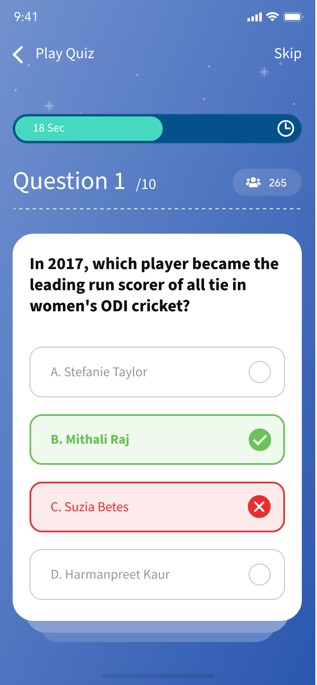

  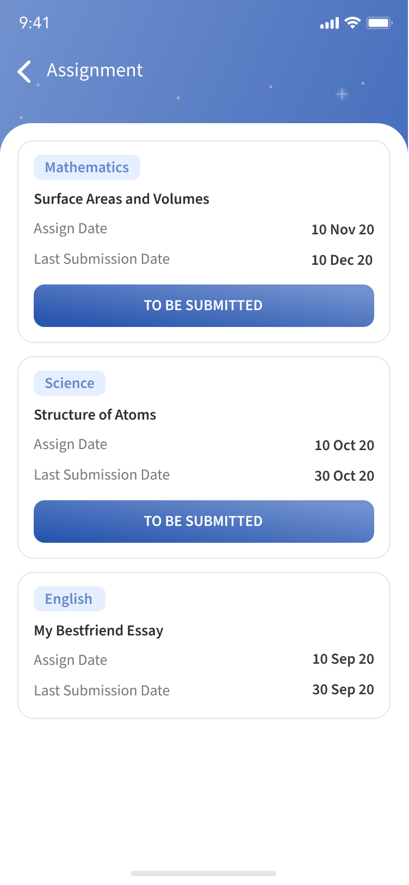
  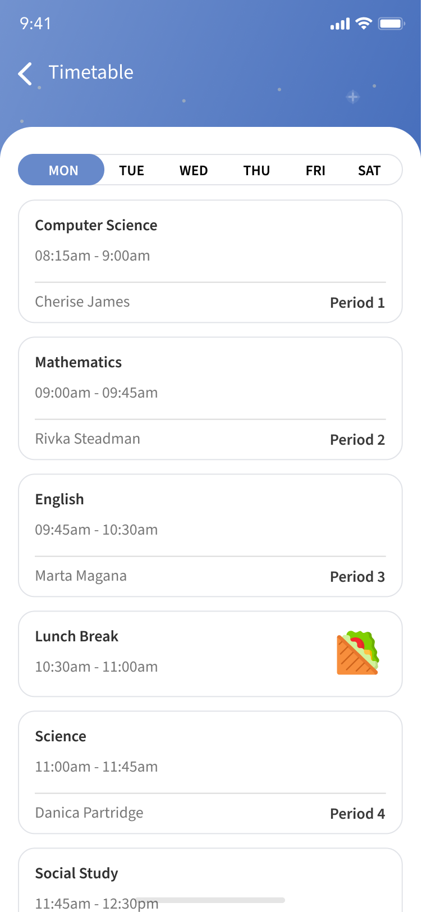
  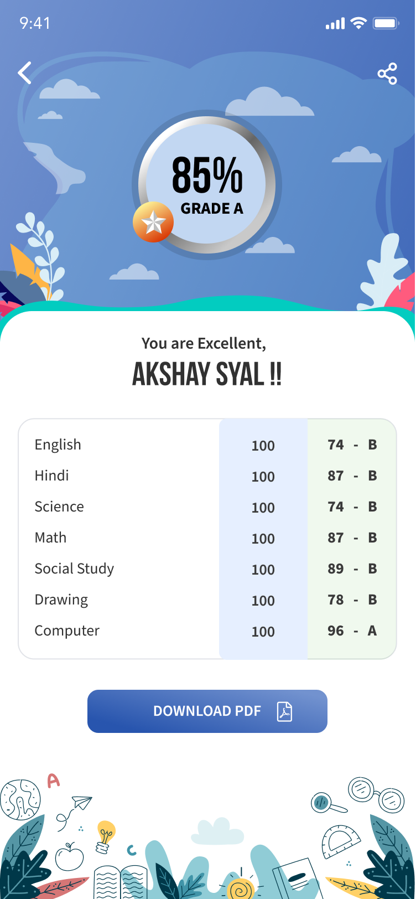

  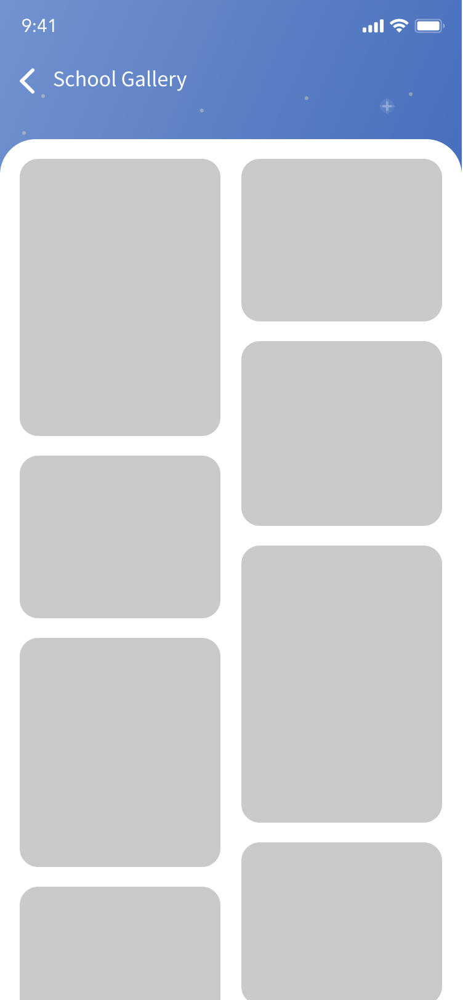
  <!-- Add more rows as needed -->

 
 

---
This project was developed by [Sachin](https://github.com/i-sachinkumar).
---
Special thanks to [@syalakshay](https://github.com/syalakshay) for his valuable contributions to the UI design. The project benefited greatly from his community post, and I appreciate the creativity and effort put into the design.

---
## **Disclaimer:**

This code is the intellectual property of the project owner. You are not allowed to use, modify, or distribute this code without explicit permission from the owner.

If you are interested in using this code, please contact the owner at [rjsk.gaya@gmail.com] for permission.
